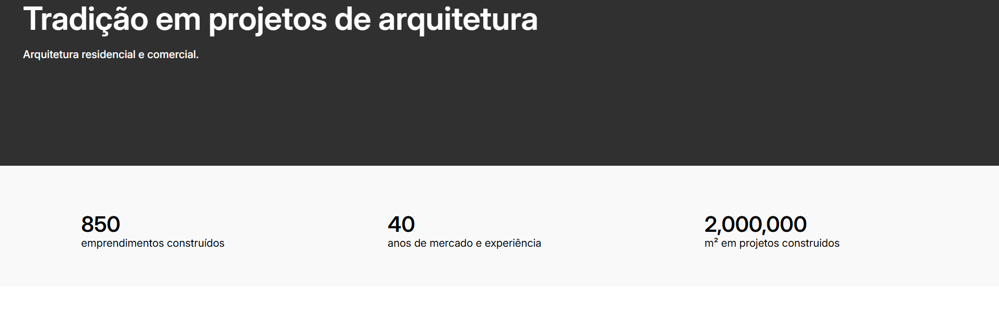
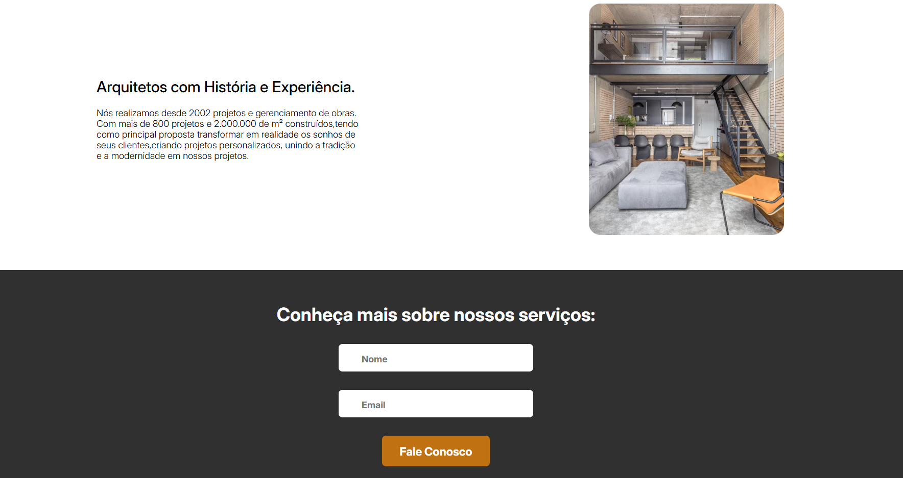

<h1 align="center" style="font-weight: bold;">Landin Page DNC 💻</h1>

 <a href="#tech">Technologies</a> • 
 <a href="#started">Getting Started</a> • 

    <b>- É uma página de captura de dados o qual captura o email e nome do usuário para que possamos oferecer ofertas afim de conseguir um cliente.</b>
    <b>- Após prencher o formulário envia para meu linkedin ja que é um desafio e não uma landing que fiz para clientes.</b>

     https://thalesfortes.github.io/landing-page/

<h2 id="layout">🎨 Layout</h2>

      
    

<h2 id="technologies">💻 Technologies</h2>

- HTML5
- CSS3
- NETLIFY
- SheetMonkey

<h2 id="started">🚀 Getting started</h2>

- Just download the project with its assets and run it with liveserve or just by opening the html document
- Data storage was done by sheet monkey where it saves name and email in excel for future [Data](https://docs.google.com/spreadsheets/d/1RKwqT5NuhJYHd7liOhy9tCt7oUg1CwOY8TR4UHFeUYg/edit?usp=sharing)
- Deployment was done by the Netlify website [site](https://arquiteture.netlify.app/)

